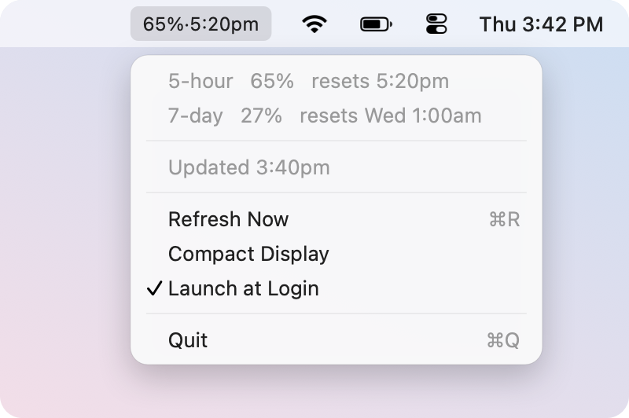

# Claude Quota Bar

A tiny macOS menu bar readout of your Claude subscription quota.

<p align="center">
  
</p>

That is the whole interface: how much of the current 5-hour window you have used,
and when it resets. Click it for the 7-day window and a refresh button.

Four source files, about 600 lines. No preference panes, no setup wizard, no
auto-updater, no account switcher, no config file.

## Why this exists

Other trackers I tried kept silently dropping out and needed relaunching. The
cause turned out to be how they authenticate: they read Claude Code's OAuth
token, and when it expires they redeem the refresh token and **write the rotated
credentials back to the keychain**.

Refresh tokens rotate on use. When a second process refreshes them, it races with
Claude Code itself and each invalidates the other's copy. That is the intermittent
breakage.

This app **never redeems the refresh token itself** and never writes to the
keychain. When the stored token expires it shells out to `claude auth status`,
which costs nothing and leaves Claude Code as the sole owner and sole writer of
the credential. No race, no possibility of breaking your login.

That fallback matters more than it sounds. A Claude Code session that is already
running holds its token in memory and does not write a refreshed copy back — so
"just keep using Claude Code" does not necessarily fix an expired stored token.
Working all day in one session can leave it expired for hours.

If the free renewal does not take, the app escalates once an hour to a minimal
`claude -p` turn (about 1k tokens), which forces the CLI to refresh and persist.
The hourly cap keeps a genuinely broken login — signed out, revoked — from
burning tokens on every poll.

## Install

```bash
git clone https://github.com/25qi/claude-quota-bar.git
cd claude-quota-bar
./install.sh
```

The script builds, bundles a `.app` into `~/Applications`, ad-hoc signs it, and
launches it. Re-run it to update — it stops the old copy first.

Then:

1. macOS asks for keychain access on first run. Choose **Always Allow**.
2. Open the menu bar dropdown and tick **Launch at Login**.

That is the last time you need to touch it.

### Requirements

- macOS 13 or later
- Swift 5.9 or later (Xcode or the Command Line Tools)
- Claude Code installed and signed in — the app reads its existing credentials
  and has no login flow of its own

## How it works

Every 5 minutes it sends the cheapest possible request to the Messages API:

```json
{ "model": "claude-haiku-4-5-20251001", "max_tokens": 1,
  "messages": [{ "role": "user", "content": "hi" }] }
```

The reply is discarded. What matters is the rate-limit headers that come back:

| Header | Meaning |
| --- | --- |
| `anthropic-ratelimit-unified-5h-utilization` | 5-hour window used, `0.0`–`1.0` |
| `anthropic-ratelimit-unified-5h-reset` | 5-hour reset, Unix timestamp |
| `anthropic-ratelimit-unified-7d-utilization` | 7-day window used |
| `anthropic-ratelimit-unified-7d-reset` | 7-day reset, Unix timestamp |

The numbers come straight from the server, so they always agree with your real
quota — nothing is inferred or accumulated locally.

A `429` is treated as a success, not a failure: being rate limited is exactly what
the app is there to show you, and the headers still arrive on that response.

### Cost

About **11 tokens per poll** (10 in, 1 out), so roughly **3,200 tokens per day**
at the default 5-minute interval.

For scale, ten polls back to back did not move the utilization figure at all —
the headers report to the nearest 1%, and ten polls do not come close to that.
A full day of polling costs less than a single ordinary question to Claude.

### A side effect worth knowing

The 5-hour window starts when you first use Claude and does not advance on its
own; if it expires while you are away, nothing happens until you send something.

Because each poll is a real billed request, running this app means the window is
continuously chained while your Mac is awake. If you care about that, it is a
feature. Note it stops during sleep and shutdown — the poll timer is suspended
with the system. The app refreshes immediately on wake.

## Privacy

- The OAuth token is read from the login keychain (or `~/.claude/.credentials.json`)
  and used only as the `Authorization` header on requests to `api.anthropic.com`.
- It is never logged, never printed, never written anywhere, and never sent to any
  other host.
- No analytics. The app itself talks only to the Messages API. When the stored
  token has expired it runs the `claude` CLI to renew it, and that CLI makes its
  own authenticated calls to Anthropic.

## Troubleshooting

**I cannot find it in the menu bar.**
On MacBooks with a notch, macOS silently hides menu bar items that do not fit,
starting with the ones nearest the notch — which is where a newly launched app's
item lands. Hold <kbd>⌘</kbd> and drag it rightwards, towards the clock, so that
something else gets pushed out instead. The position is remembered.

If it still does not fit, shorten it to just the percentage with
**Compact Display** in the dropdown. When the item is hidden you cannot reach
that menu, so it can also be set from Terminal:

```bash
defaults write com.qi.claude-quota-bar compactTitle -bool true
pkill -f "Claude Quota Bar.app"; open ~/Applications/"Claude Quota Bar.app"
```

Use `false` to switch back.

**It shows a dash or the number is greyed out.**
The token is expired or the network is down. Open the dropdown to see the reason.
On an expired token the app tries to renew it automatically; if it stays grey,
run `claude auth status` in a terminal and check you are still signed in.

**Launch at Login will not stick.**
`SMAppService` requires a signed bundle. `install.sh` ad-hoc signs it; if you
copied the binary somewhere by hand instead, run the script.

### Checking without the UI

```bash
./.build/release/ClaudeQuotaBar --probe
```

```
5h   20.0%  resets 2026-09-02 05:50
7d    0.0%  resets 2026-09-09 01:00
```

One fetch, printed, then exit. Never prints the token.

## Limitations

- Percentages only. The headers do not expose absolute token counts, so there is
  no "1.2M of 5M tokens" reading to be had.
- Subscription accounts only. It uses Claude Code's OAuth credentials, not an
  API key.
- Single account. There is no profile switcher and there will not be one.

## License

MIT
