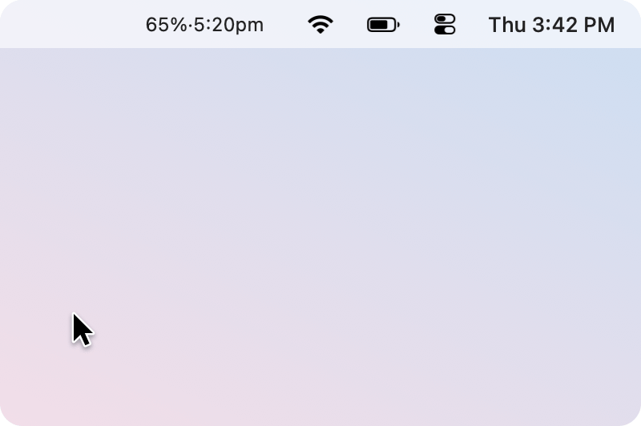

# Claude Usage Tide

A tiny macOS menu bar app that shows your Claude subscription usage.

<p align="center">
  
</p>

The menu bar shows how much of the 5-hour window you have used and when it resets, as in `65%·5:20pm`. It updates every 5 minutes. The dropdown adds the 7-day window.

Inspired by [Claude Usage Tracker](https://github.com/hamed-elfayome/Claude-Usage-Tracker) by [@hamed-elfayome](https://github.com/hamed-elfayome), which is also where the rate-limit header approach comes from. This is a stripped-down version: just the usage reading, with no settings, profiles or updater.

## Install

### Homebrew

```bash
brew install 25qi/tap/claude-usage-tide
brew services start claude-usage-tide
```

`brew services` starts it now and at every login. Update with `brew upgrade claude-usage-tide`.

### From source

```bash
git clone https://github.com/25qi/claude-usage-tide.git
cd claude-usage-tide
./install.sh
```

Then tick **Launch at Login** in the dropdown. Run `./install.sh` again to update.

### First run

macOS asks whether `security` may read "Claude Code-credentials". Choose **Always Allow**. This is how the app reads Claude Code's token.

**Requirements:** macOS 13+, Swift 5.9+, and Claude Code installed and signed in.

## How it works

Every 5 minutes it sends a 1-token request to the Messages API and reads these response headers:

| Header | Meaning |
| --- | --- |
| `anthropic-ratelimit-unified-5h-utilization` | 5-hour usage, `0.0`–`1.0` |
| `anthropic-ratelimit-unified-5h-reset` | 5-hour reset, Unix time |
| `anthropic-ratelimit-unified-7d-utilization` | 7-day usage |
| `anthropic-ratelimit-unified-7d-reset` | 7-day reset, Unix time |

Each poll costs about 11 tokens, or roughly 3,200 a day.

It reads Claude Code's OAuth token but never refreshes it or writes to the keychain, because refreshing it from a second process can log Claude Code out. When the token expires, the app runs `claude auth status` to get the CLI to renew it. If that doesn't work, it runs a minimal `claude -p` (about 1k tokens), at most once an hour.

The token is only sent to `api.anthropic.com`. It is never logged or stored.

## Troubleshooting

**The item is missing.** On notched MacBooks, macOS hides menu bar items that don't fit. Hold <kbd>⌘</kbd> and drag it towards the clock. If it still doesn't fit, turn on **Compact Display** to show just the percentage. If the item is hidden, you can turn it on from Terminal:

```bash
defaults write com.qi.claude-usage-tide compactTitle -bool true
pkill -f "Claude Usage Tide.app"; open ~/Applications/"Claude Usage Tide.app"
```

**The number is grey.** The token has expired or the network is down. Open the dropdown to see which. If it stays grey, run `claude auth status`.

**Check without the UI:** `./.build/release/ClaudeUsageTide --probe`

## License

MIT
